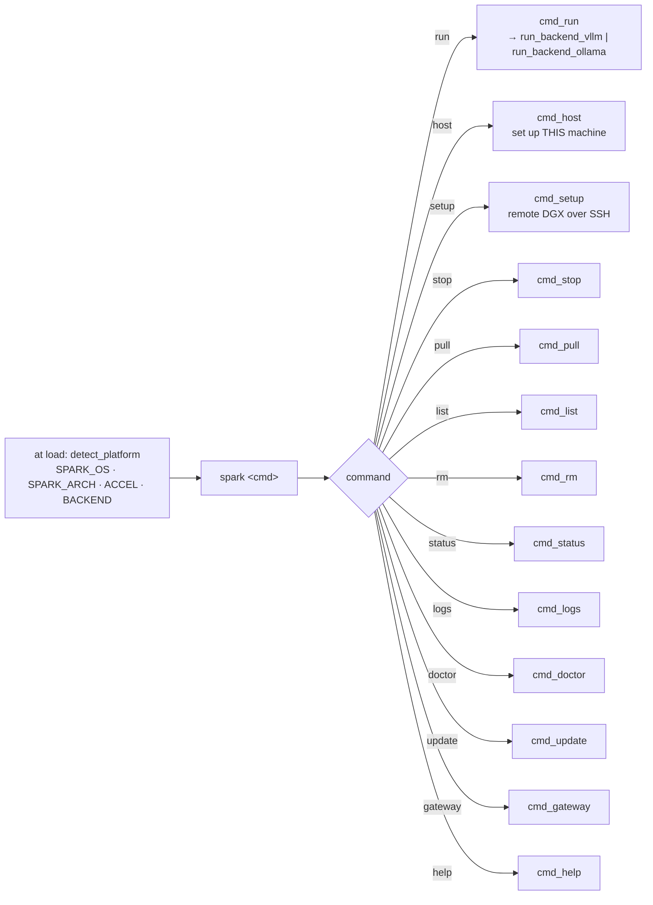
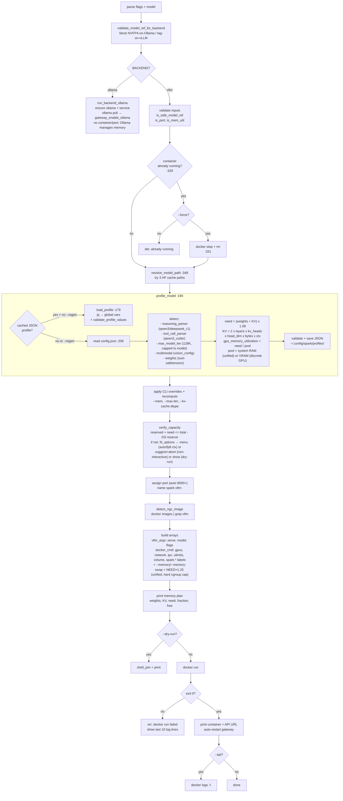
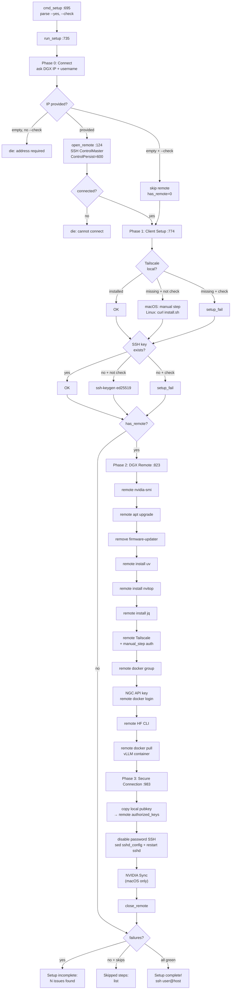
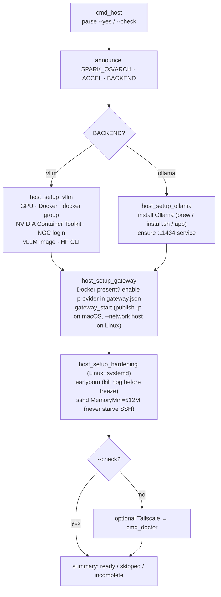
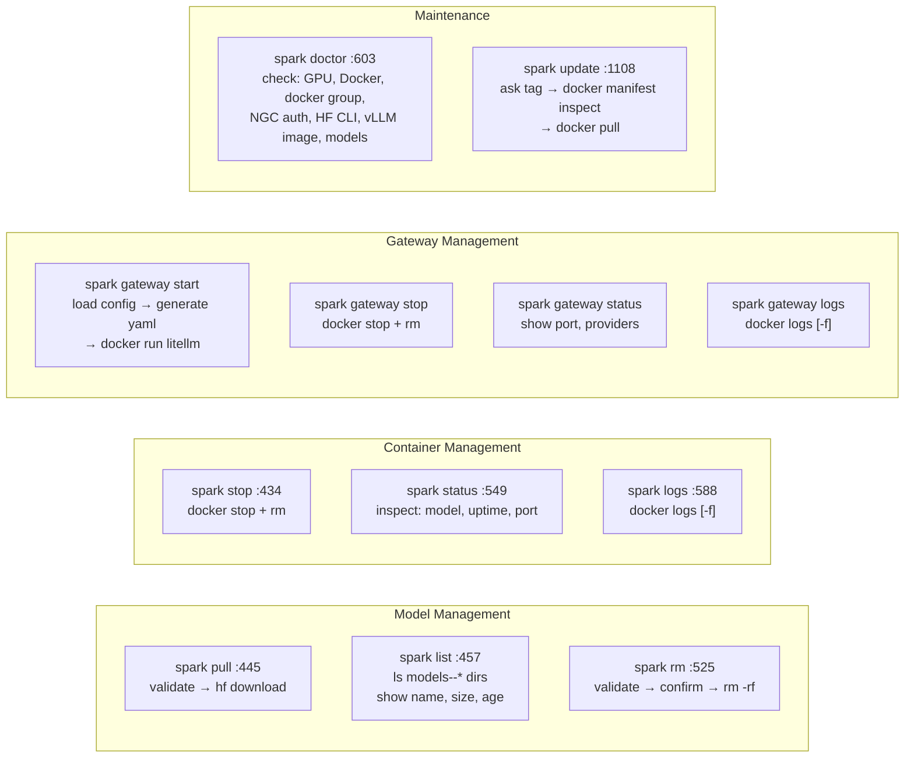

# spark — Logic Flow

Open in any Mermaid viewer (GitHub renders it, or paste in mermaid.live).

## Main dispatcher

`detect_platform` classifies the accelerator (`cuda-unified` / `cuda-discrete` / `metal` / `cpu`)
and selects the backend (`vllm` on NVIDIA, `ollama` otherwise). It runs once at load; everything
below reads `ACCEL`/`BACKEND`.

## spark run (core path)

## spark setup (wizard)

## spark host (set up THIS machine)

The gateway always runs in Docker (so reboot-persistence matches Linux), but its networking branches
by OS: on macOS it publishes the port and reaches the host's native Ollama via
`host.docker.internal:11434`; on Linux it shares the host network and uses `localhost`. The YAML uses
the `ollama_chat/*` route.

## Simple commands

