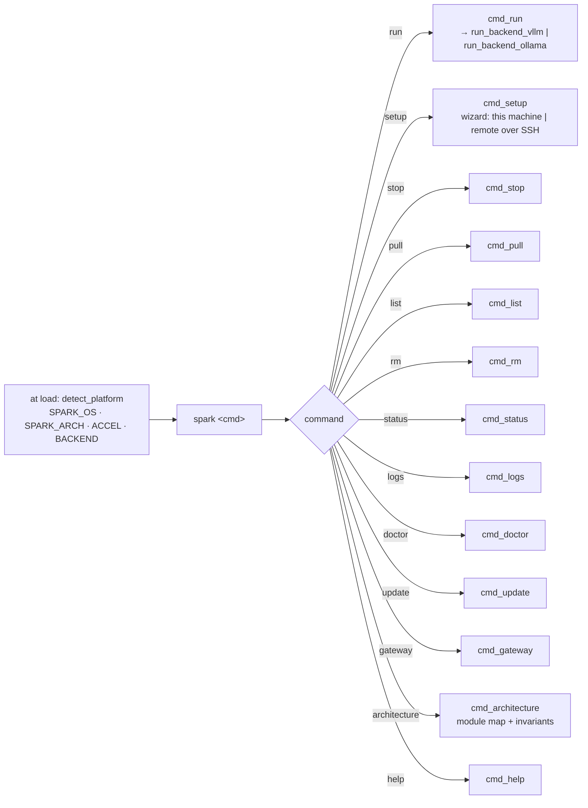
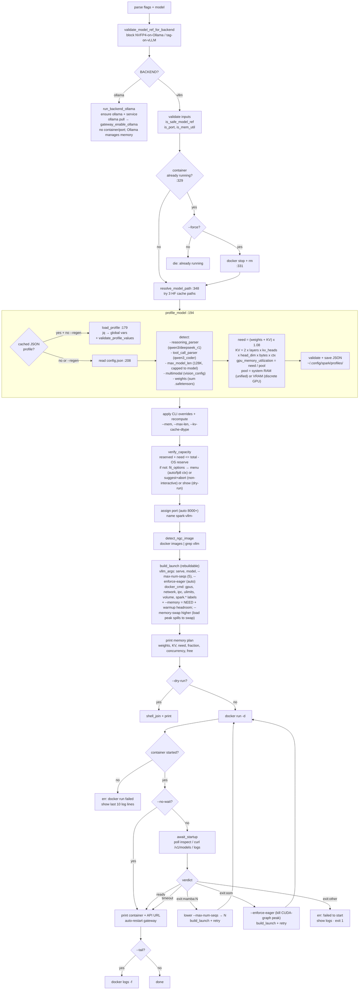
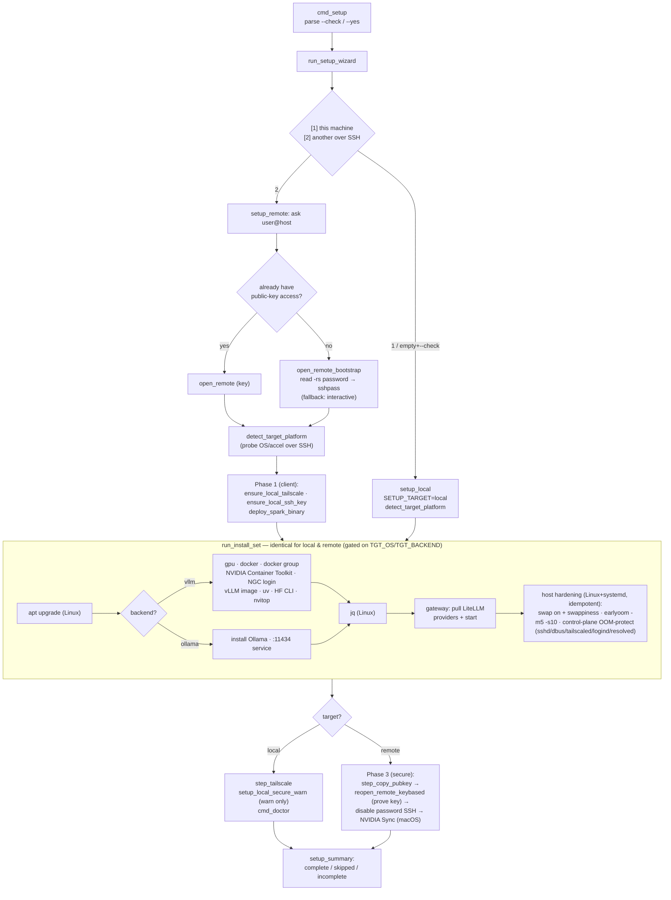
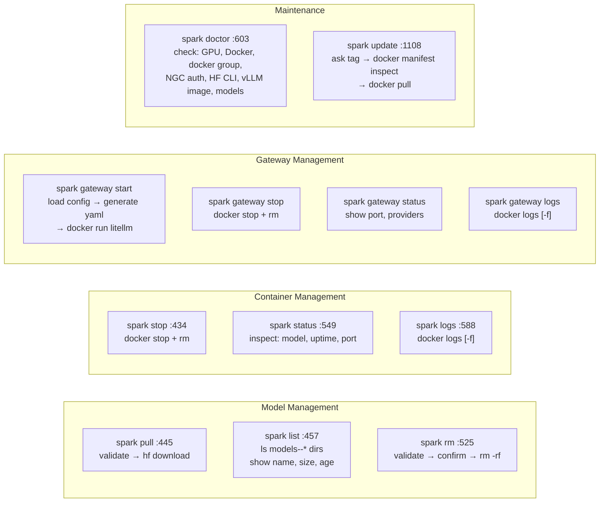

# spark — Logic Flow

Open in any Mermaid viewer (GitHub renders it, or paste in mermaid.live).

For the current developer module map and source-boundary rules, run `spark architecture`.
The audit and refactor plan live in `docs/architecture.md`.

## Main dispatcher

`detect_platform` classifies the accelerator (`cuda-unified` / `cuda-discrete` / `metal` / `cpu`)
and selects the backend (`vllm` on NVIDIA, `ollama` otherwise). It runs once at load; everything
below reads `ACCEL`/`BACKEND`.

## spark run (core path)

`docker run -d` only reports that the container *started* — vLLM can still crash seconds later during
init (e.g. a hybrid/Mamba model whose concurrency exceeds the cache it can allocate). So spark
**supervises**: `await_startup` waits until the API serves, the container exits, or it times out. On a
recoverable exit it adjusts one lever and retries — lower `--max-num-seqs` for cache-block failures
(keeps memory tight), or `--enforce-eager` for a warmup OOM (removes the CUDA-graph capture peak). On
success it caches the measured peak (cgroup `memory.peak`) per model. `--no-wait` skips supervision.

## spark setup (one wizard, one install set)

`spark setup` asks **where** to install, then runs a single shared install set (`run_install_set`)
against the chosen target via the `ctx_*` layer — so a server gets the **same software** whether
configured locally or over SSH. `--check` reports without changing anything; `--yes` auto-confirms.

Key safety points: in **host** mode spark never disables password SSH automatically (you could
lock yourself out) — it only warns. In **server** mode it disables password auth **only after**
`reopen_remote_keybased` proves the freshly-copied key works; if that reconnect fails it aborts
before touching `sshd_config`.

The gateway always runs in Docker (so reboot-persistence matches Linux), but its networking branches
by OS: on macOS it publishes the port and reaches the host's native Ollama via
`host.docker.internal:11434`; on Linux it shares the host network and uses `localhost`. The YAML uses
the `ollama_chat/*` route.

## Simple commands

